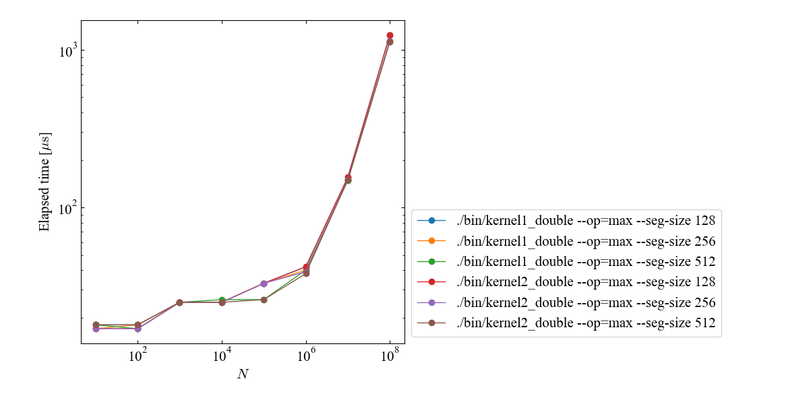

# Reduction Benchmark Tool

This benchmark tool is designed to measure and compare the performance of various CUDA reduction implementations.
It allows you to evaluate the elapsed times of multiple implementations under different build and execution settings, and automatically generates performance plots from the measured results.

## Usage

### 1. Configure benchmark cases

Edit [config/cases.json](./config/cases.json) and specify:
* compile command
* execution command
* input array length

### 2. Run benchmark

```
python3 run.sh
```

This command automatically:
* compiles each benchmark case,
* executes the generated binaries,
* collects elapsed time results.

### 3. Generate performance plot

After all benchmark runs are completed, execute:

```
python3 plot/plot_performance.py
```

Then the `plot/elapsed_time.png` will be generated automatically.

